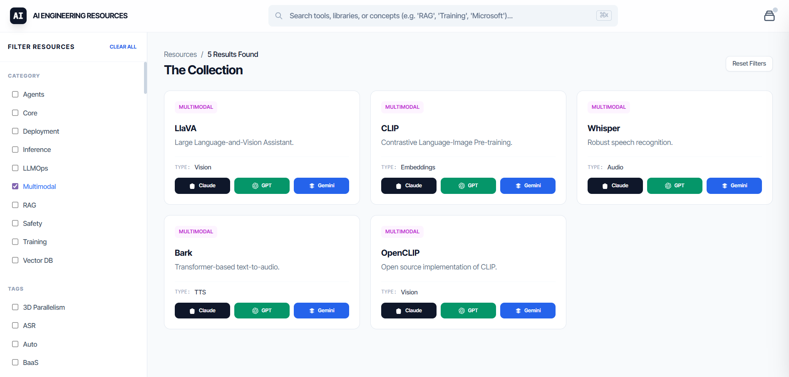

# [AI Engineering Resources](https://akshayparihar07.github.io/aiEngineeringResources/)

A dashboard for discovering and organizing the best tools, libraries, and resources for AI Engineering in 2026.

 
## 🚀 Features

- **🎯 Advanced Filtering**: Streamlined sidebar with multi-select checkboxes for Categories, Tags, and Resource Types.
- **🔍 Intelligent Search**: Instant search with a dedicated keyboard shortcut (`⌘K` or `Ctrl+K`).
- **🤖 One-Click AI Research**: Deep-linked buttons to instantly research any tool in **ChatGPT**, **Claude**, or **Google AI Studio** with pre-filled expert prompts.
- **🏗️ Stack Builder**: Add tools to your personal "AI Stack" to visualize your engineering lifecycle and get balance insights.

## 📋 How to Use Locally

Simply open the `index.html` file in any modern web browser. No complex setup or installation is required as it is build with a portable, single-file architecture.
